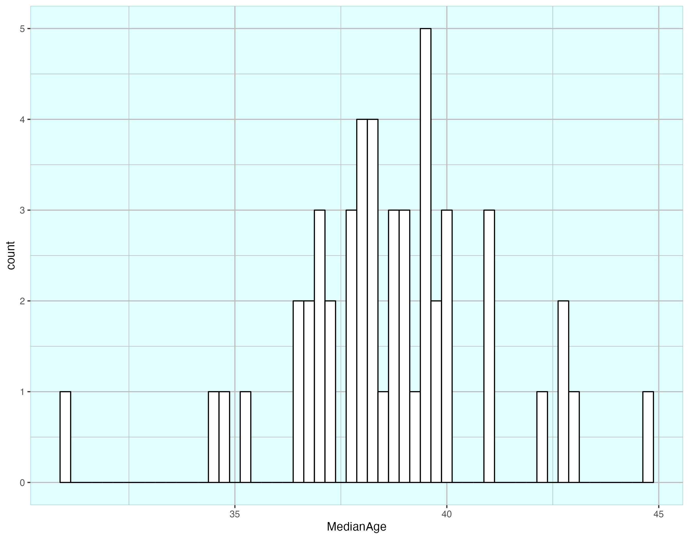
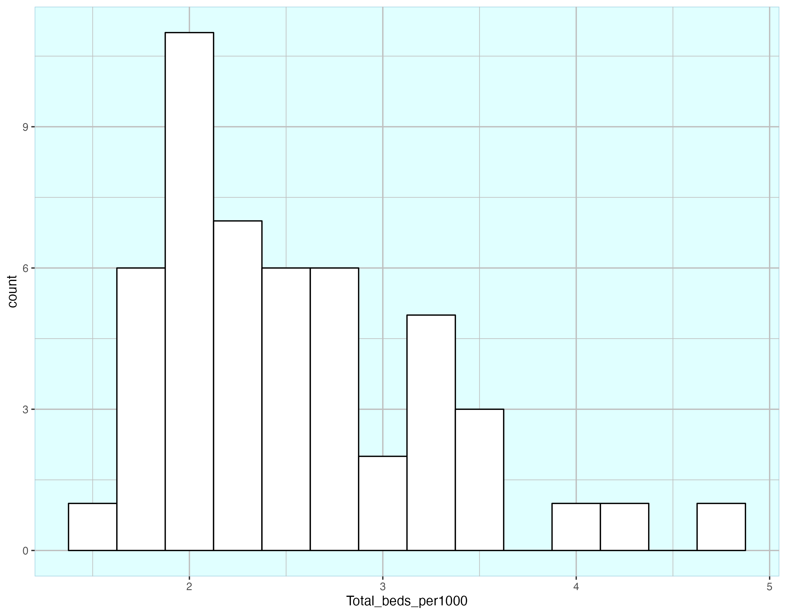
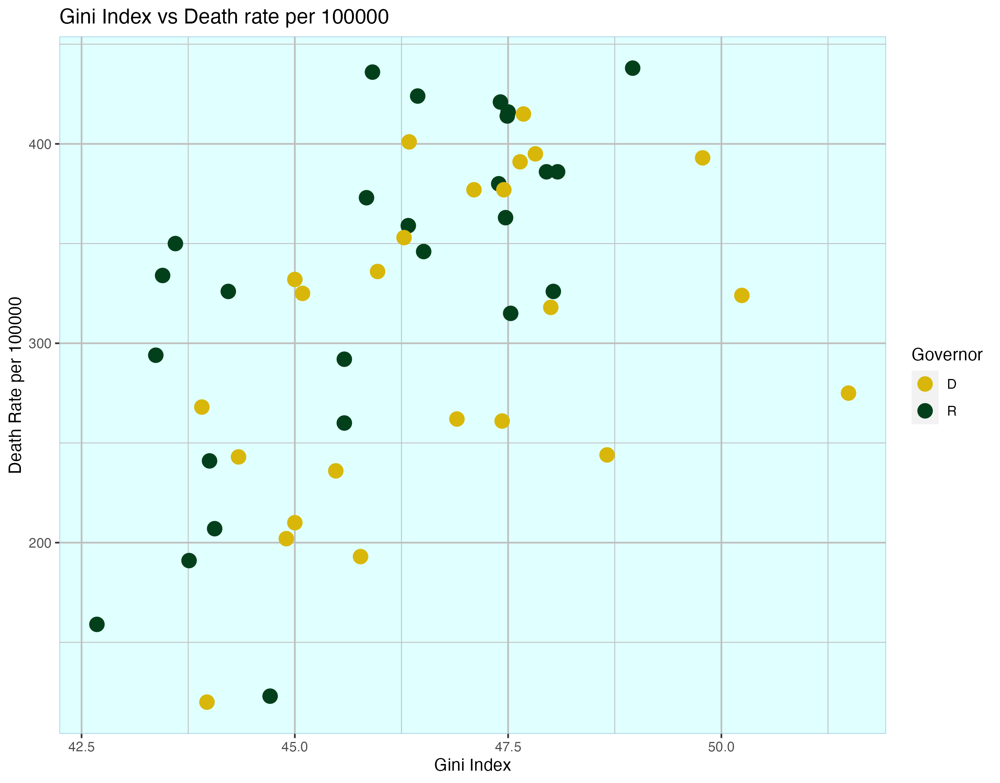
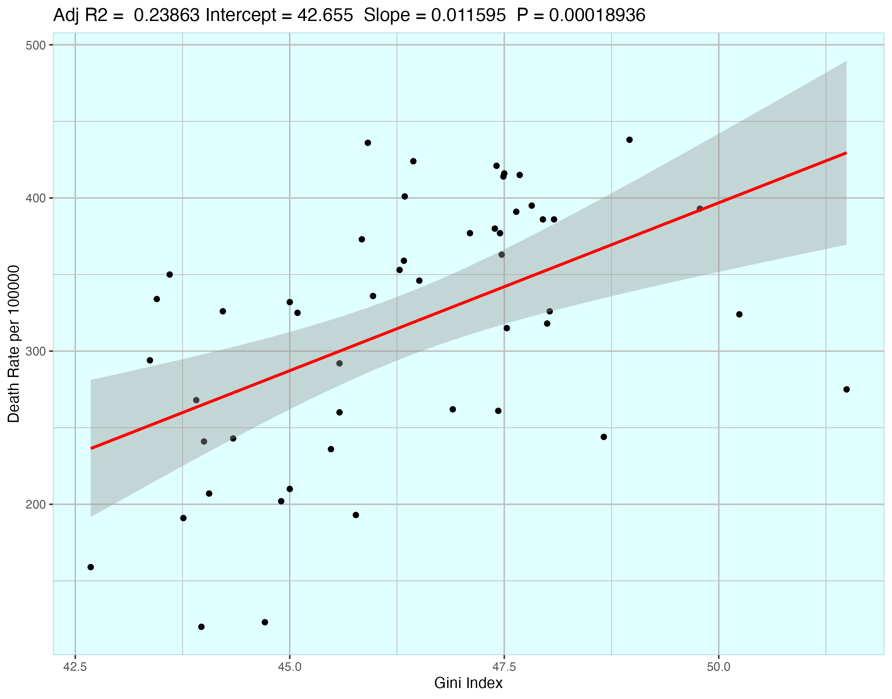
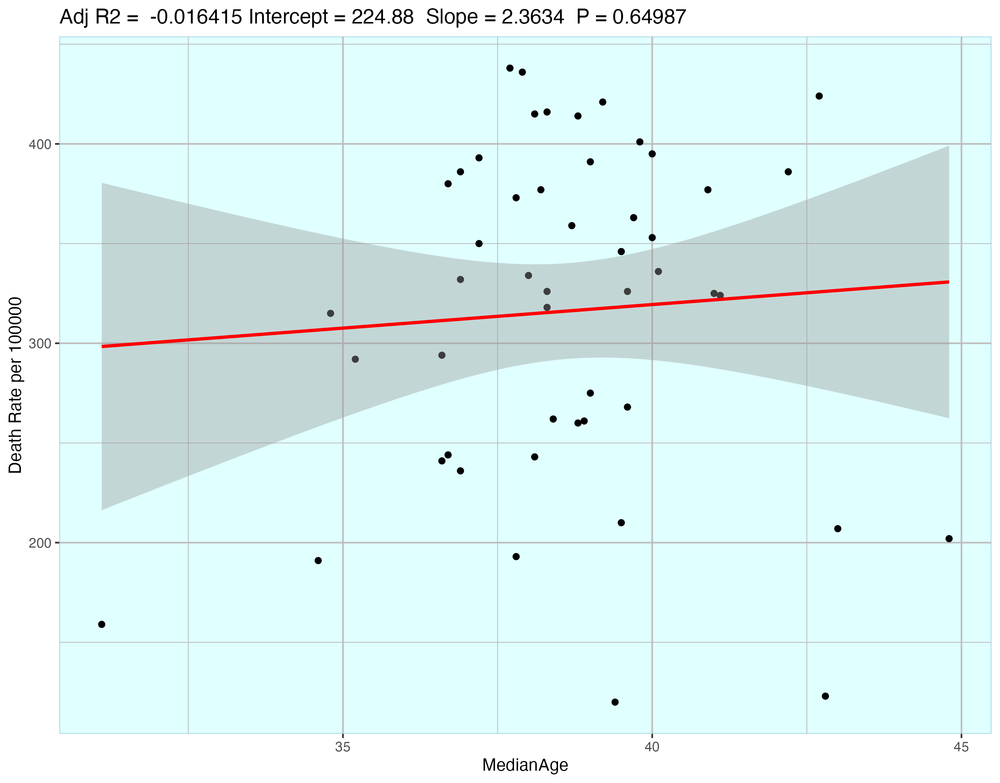
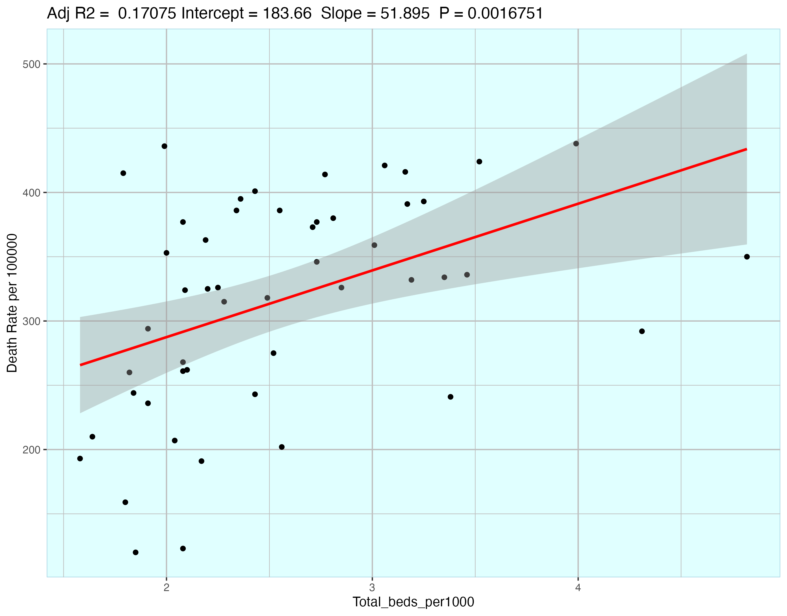
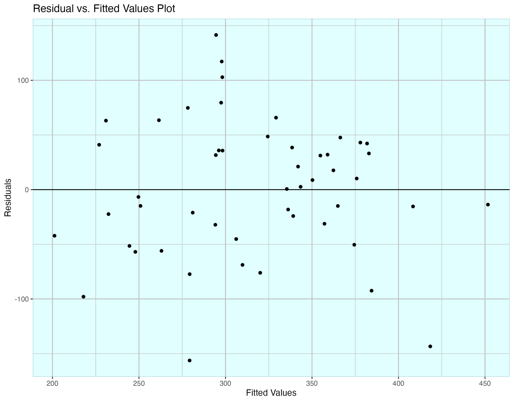
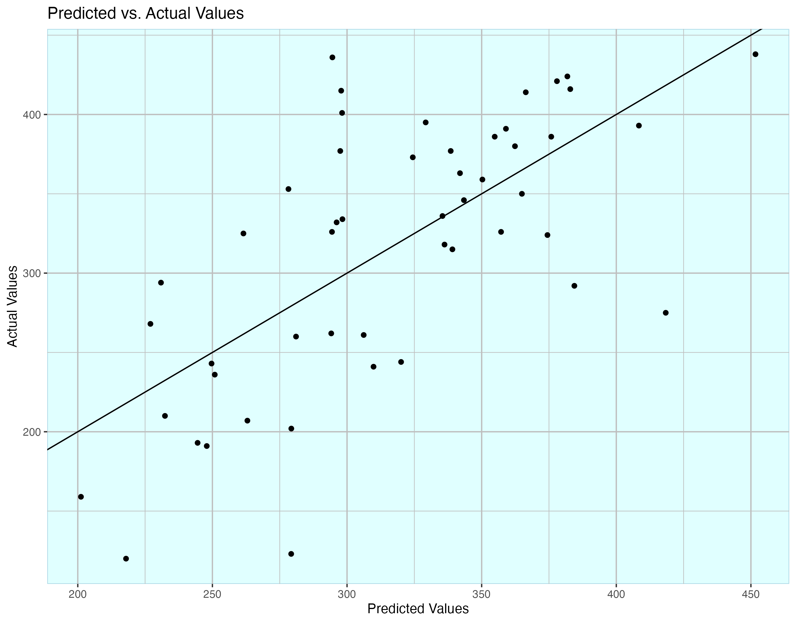

# COVID19 hospitalizations/death
This is the project for 2022FALL BST625. We choose the data about COVID19 from 50 states in the U.S. by 2020 and try to find the relationship between hospitalizations and death from many aspects.
### Group8 member:
- Chen, Ye
- Aaron, Ruby
- Bader, Alsuliman 
- Alireza, Abdshah
- Nawaf, Alhazmi 
  
## Data Introduction
### united_states_covid19_cases_deaths_and_testing_by_state_states only.xlsx
> The xlsx file contains the test number and the deanths based on different states.
### gini index.xlsx
> The file contains gini index of all states in the U.S.
### states_beds_per1000.csv
> The staffed beds number in 50 states which can reveal the hospital resource of different states.
### US govenors party 2020.xlsx
> The govenors party can show the difference of the direction of policies.
### US state median population.xlsx
> This file contains the median age of the U.S.
## Data Visualization
We use ggplot to draw several graphs to showing basic descriptive statistic in several graphs.
At first, we show the histogram of all independent variable to check the normality.

Then we use scatterplots to check the relationships between variables.
.png)

## Models
First we use simple regression model to try to estimate the relationship bewteen the variables
### Regression for Gini Index per Death Rate

### Regression for Age per Death Rate

### Regression for beds per Death Rate

Finally, we decide to combine them and use a multiple regression for the model.

The first graph represents the residual for the model and the second graph compares the predicted value and the observed value.
The final model results is:
|                    | estimates | std.error | t value | p value  |
|--------------------|-----------|-----------|---------|----------|
| Intercepts         | -932.628  | 266.253   | -3.503  | 0.00105  |
| Total_beds_per1000 | 43.917    | 13.980    | 3.141   | 0.00297  |
| medianAge          | 1.661     | 4.069     | 0.408   | 0.68506  |
| gini index         | 22.831    | 4.964     | 4.599   | 3.45e-05 |
| governor           | 28.693    | 20.146    | 1.424   | 0.16126  |

## Summary
Hospital Beds/1000 people and Gini Index were statistically significant, while Median age and Party of the State Governor were not 
## Limitations
The use of only 50 states may not be enough variation to see differences in certain variables; i.e. median age
All State Governors don’t necessarily govern along partisan lines
beds/1000 people has a positive relationship with COVID deaths which is an unexpected result
## Public Health
Hospital Beds/1000 people may not be a good indicator of healthcare readiness
Inequality (gini index) may be a good indicator of access to healthcare
Relationships between COVID deaths and other variables are not always true to what you hear in the media or the news
